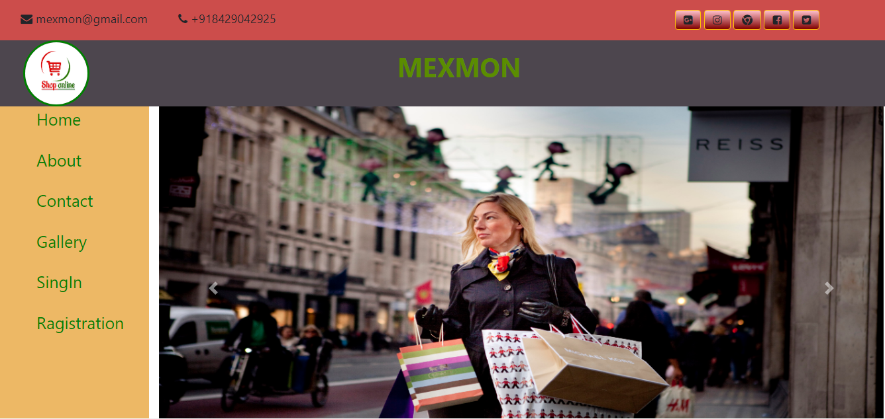
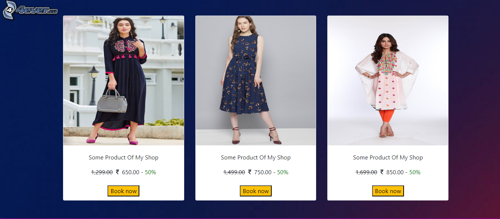
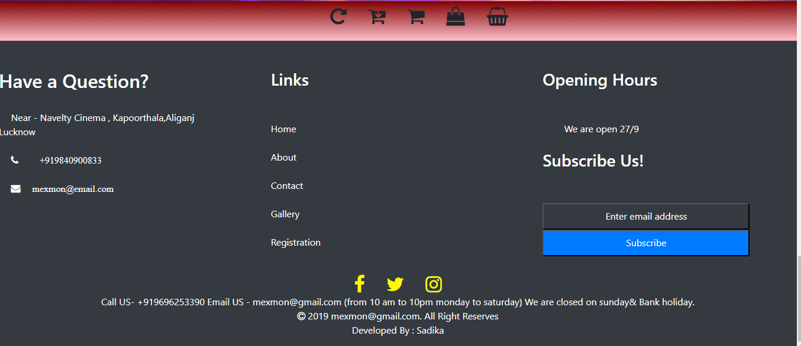
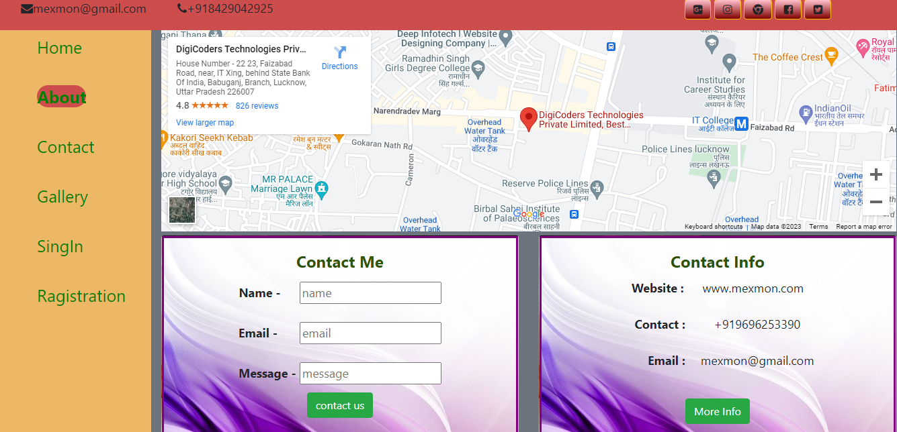
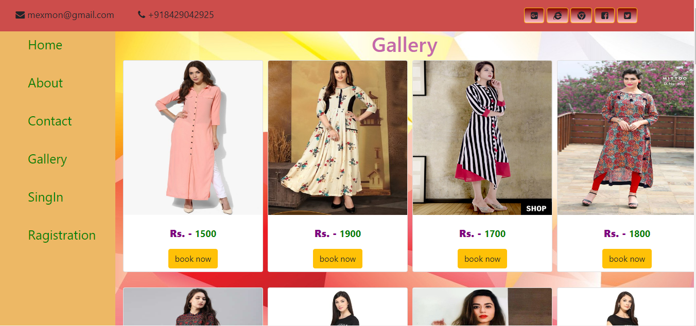
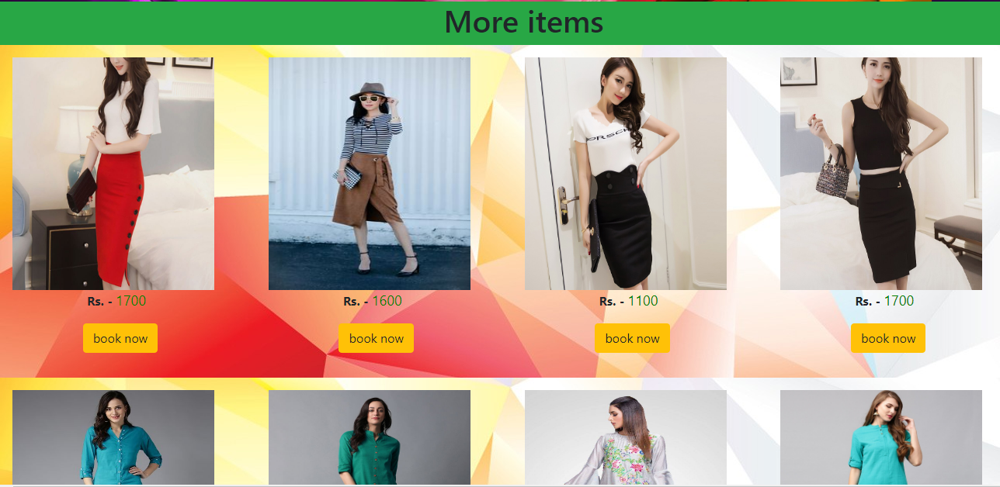
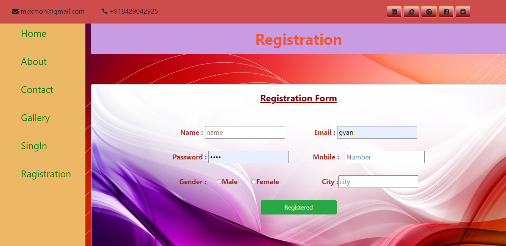

 
<h1>Online Shopping Website</h1>
 <b>Online Shopping is a cutting-edge online women's clothing shopping destination, where fashion enthusiasts discover a curated selection of stylish apparel and accessories. Our platform offers a seamless and user-friendly experience, enabling customers to explore the latest trends, from casual wear to elegant ensembles. We prioritize inclusivity, catering to women of all sizes, ensuring a perfect fit for every body shape. With secure payment options and efficient delivery services, we provide a hassle-free shopping experience. At [Your Website Name], we redefine online shopping by blending fashion expertise with convenience, empowering women to express their unique style confidently. Join us and elevate your wardrobe with our diverse, high-quality fashion collections." My project is build in by using Html5, Css3, JavaScript,
Bootstrap, MySql database and Php .
</b> 
 <h2> Quick Start </h2>
 <b>db ---></b> it is database folder  

# That's all 🎊🎉 

## ScreenShots
   
   
   
   
   
   
   
   

